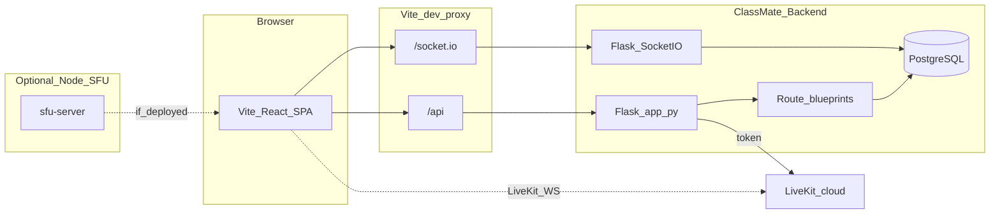

# ClassMate — Agent routing map (`structure.md`)

**Read this file first** before implementing features, fixing bugs, or refactoring in this repository. It tells you where code lives, which files to open for a given task, and which paths to **skip** so you do not burn context on irrelevant trees.

---

## 1. Agent instructions

### 1.1 Workflow

1. Read **this** document and jump to the section that matches the user request (route map, task routing, file inventory, or future-feature bundles).
2. Open **recommended** the files listed under “Read if” for that task. Prefer reading cited paths directly instead of listing entire directories.
3. After you change routes, APIs, or folder layout, update **this** file in the same change so it stays accurate.

### 1.2 Do not waste context on

- `**/node_modules/**` — dependencies; never hand-edit unless the task is explicitly about package upgrades.
- `**/.venv/**` — local Python virtualenv for the Flask app.
- `**/dist/**`, `**/build/**` — generated frontend output.
- Lockfile bodies (`package-lock.json`) line-by-line — only open when resolving dependency or lockfile conflicts.

### 1.3 Workspace layout (critical)

| Path | Meaning |
|------|---------|
| Cursor workspace root | Often `/.../classmate-virtual-classroom-and-meeting-platform` (outer folder). |
| **Application root** | `classmate-virtual-classroom-and-meeting-platform/code/my-react-app/` — this is where `package.json`, `vite.config.js`, and `src/` live. |

All paths below are **relative to the git repo folder** `classmate-virtual-classroom-and-meeting-platform/` (the directory that contains this `structure.md`).

### 1.4 How to run locally

- **Frontend:** from `code/my-react-app/`, run `npm run dev` (Vite, default port **5173**).
- **Backend (Flask):** `npm run dev:backend` from `code/my-react-app/` (runs `src/ClassMate-Backend/app.py` with `.venv` or system `python3`).
- **Both:** `npm run dev:all` (uses `concurrently`).

### 1.5 API and WebSocket during dev

[`code/my-react-app/vite.config.js`](code/my-react-app/vite.config.js) proxies:

- `/api` → `process.env.VITE_API_URL` or `http://localhost:5000`
- `/socket.io` → same target, WebSockets enabled

Frontend code should prefer **relative** URLs like `/api/...` in local dev so the proxy applies. Hardcoded production Railway URLs in some components bypass the proxy — normalize those only when the task is “fix API base URL / env”.

---

## 2. Architecture snapshot

**ClassMate** is a university-oriented virtual classroom: React SPA + Flask REST/Socket.IO API + PostgreSQL (via `psycopg2`). Real-time features use **Socket.IO** on the Flask app; **LiveKit** token minting exists in `app.py`. A separate **Node `sfu-server`** can provide SFU-style signaling (Express + Socket.IO + optional Redis adapter).

---

## 3. Task → entry files (routing)

- **New page or URL** → [`code/my-react-app/src/App.jsx`](code/my-react-app/src/App.jsx) + the page component under `src/*.jsx` + matching `src/*.css` if present.
- **Login / signup / OTP / forgot password** → `Login.jsx`, `Signup.jsx`, `otpVerify.jsx`, `forgotPassword.jsx` + [`ClassMate-Backend/auth_routes.py`](code/my-react-app/src/ClassMate-Backend/auth_routes.py), `loginRoutes.py`, `forgotRoutes.py`.
- **Teacher flows (profile, courses, meetings)** → `teacherDashboard.jsx`, `teacherProfile.jsx`, `courseProfile.jsx`, `scheduleForm.jsx`, `updateForm.jsx`, `manageMeeting.jsx`, `manageEnrollment.jsx` + [`teacherRoutes.py`](code/my-react-app/src/ClassMate-Backend/teacherRoutes.py), [`courseRoutes.py`](code/my-react-app/src/ClassMate-Backend/courseRoutes.py).
- **Student flows** → `studentDashboard.jsx`, `studentProfile.jsx`, `studentCourseProfile.jsx`, `Material.jsx` + [`studentRoutes.py`](code/my-react-app/src/ClassMate-Backend/studentRoutes.py), `courseRoutes.py`, `materialRoutes.py`.
- **Admin** → `adminDashboard.jsx` + [`adminRoutes.py`](code/my-react-app/src/ClassMate-Backend/adminRoutes.py).
- **Chat (async messaging UI)** → `chatPage.jsx`, `studentChat.jsx` + [`chatRoutes.py`](code/my-react-app/src/ClassMate-Backend/chatRoutes.py) (very large file).
- **Live lecture chat** → `liveChat.jsx` + [`liveChat.py`](code/my-react-app/src/ClassMate-Backend/liveChat.py).
- **Video / calls / meeting media** → `videoCall.jsx`, `MeetingRoom.jsx`, `PrivateCall.jsx`, `ParticipantTile.jsx`, `VideoGrid.jsx`, `CallErrorBoundary.jsx` + [`videoCall.py`](code/my-react-app/src/ClassMate-Backend/videoCall.py), socket handlers inside [`app.py`](code/my-react-app/src/ClassMate-Backend/app.py) for private rooms.
- **Materials upload/list** → `UploadMaterial.jsx`, `Material.jsx` + [`uploadMaterialRoutes.py`](code/my-react-app/src/ClassMate-Backend/uploadMaterialRoutes.py), [`materialRoutes.py`](code/my-react-app/src/ClassMate-Backend/materialRoutes.py).
- **Attendance** → `viewAttendance.jsx` + [`attendanceRoutes.py`](code/my-react-app/src/ClassMate-Backend/attendanceRoutes.py).
- **DB schema / new tables** → [`models.py`](code/my-react-app/src/ClassMate-Backend/models.py) (primary DDL), [`db.py`](code/my-react-app/src/ClassMate-Backend/db.py) if used, plus the route module that owns the feature.
- **CORS, env, LiveKit token route, global Socket.IO** → [`app.py`](code/my-react-app/src/ClassMate-Backend/app.py) (top half + blueprint registration + inline routes).
- **Lint / build** → [`eslint.config.js`](code/my-react-app/eslint.config.js), [`vite.config.js`](code/my-react-app/vite.config.js), [`package.json`](code/my-react-app/package.json).
- **Deploy** → root [`README_RAILWAY_DEPLOY.md`](README_RAILWAY_DEPLOY.md), [`code/my-react-app/vercel.json`](code/my-react-app/vercel.json), [`code/my-react-app/docker-compose.yml`](code/my-react-app/docker-compose.yml), [`ClassMate-Backend/render.yaml`](code/my-react-app/src/ClassMate-Backend/render.yaml), [`sfu-server/railway.json`](code/my-react-app/sfu-server/railway.json).

---

## 4. Frontend route map (`App.jsx`)

| URL path | Component file |
|----------|----------------|
| `/` | `src/Login.jsx` |
| `/signup` | `src/Signup.jsx` |
| `/ForgotPassword` | `src/forgotPassword.jsx` |
| `/otpVerify` | `src/otpVerify.jsx` |
| `/adminDashboard` | `src/adminDashboard.jsx` (registered **twice** with the same path — duplicate `Route`) |
| `/studentDashboard` | `src/studentDashboard.jsx` |
| `/teacherDashboard` | `src/teacherDashboard.jsx` |
| `/teacherProfile/:teacherId?` | `src/teacherProfile.jsx` |
| `/courseProfile` | `src/courseProfile.jsx` |
| `/studentCourseProfile` | `src/studentCourseProfile.jsx` |
| `/scheduleForm` | `src/scheduleForm.jsx` |
| `/updateForm` | `src/updateForm.jsx` |
| `/manageMeeting` | `src/manageMeeting.jsx` |
| `/manageEnrollment` | `src/manageEnrollment.jsx` |
| `/attendance/:sessionId` | `src/viewAttendance.jsx` |
| `/chatPage` | `src/chatPage.jsx` |
| `/meeting/:meetingId` | `src/MeetingRoom.jsx` |
| `/Material` | `src/Material.jsx` |
| `/UploadMaterial` | `src/UploadMaterial.jsx` |
| `/studentChat` | `src/studentChat.jsx` |
| `/studentProfile` | `src/studentProfile.jsx` |

**Referenced in UI but not declared in `App.jsx` (as of this map):**

- `studentDashboard.jsx` navigates to `/studentQuizzes` — no matching `<Route>` in `App.jsx`.
- `studentCourseProfile.jsx` navigates to `/quiz/:id` — no matching `<Route>` in `App.jsx`.

Fix routing when implementing quiz-taking pages.

---

## 5. Future features: quiz generation and post-class transcript summary

There is **no** dedicated transcript pipeline or quiz-generator module in the repo today. The UI already **anticipates** quizzes (`studentCourseProfile.jsx` fetches `/api/courses/:id/quizzes`; `studentDashboard.jsx` links to `/studentQuizzes`). Use the following **bundle** as the default search set when implementing AI quiz generation or post-class transcript summarization.

### 5.1 Read first (orchestration + session context)

| File | Why |
|------|-----|
| [`code/my-react-app/src/MeetingRoom.jsx`](code/my-react-app/src/MeetingRoom.jsx) | Shell for live class: combines `VideoCall` + `liveChat`; owns `sessionId` / join flow — natural place to trigger “end class → summarize” or attach recording metadata. |
| [`code/my-react-app/src/videoCall.jsx`](code/my-react-app/src/videoCall.jsx) | WebRTC / LiveKit client logic — any capture of audio for transcription or egress hooks starts here or in siblings. |
| [`code/my-react-app/src/liveChat.jsx`](code/my-react-app/src/liveChat.jsx) | In-meeting chat transcript (text) — easiest source for “lecture chat log” summaries without audio ASR. |
| [`code/my-react-app/src/ClassMate-Backend/app.py`](code/my-react-app/src/ClassMate-Backend/app.py) | LiveKit token endpoint, Socket.IO setup — server-side jobs, webhooks, or background threads might register here. |

### 5.2 Persistence and APIs

| File | Why |
|------|-----|
| [`code/my-react-app/src/ClassMate-Backend/models.py`](code/my-react-app/src/ClassMate-Backend/models.py) | Add tables: `quiz`, `quiz_question`, `lecture_transcript`, `session_summary`, etc. |
| [`code/my-react-app/src/ClassMate-Backend/courseRoutes.py`](code/my-react-app/src/ClassMate-Backend/courseRoutes.py) | Course-scoped REST patterns; frontend already expects quiz listing under `/api/courses/.../quizzes`. |
| [`code/my-react-app/src/ClassMate-Backend/materialRoutes.py`](code/my-react-app/src/ClassMate-Backend/materialRoutes.py) | Course materials — quiz content may be derived from uploaded docs. |
| [`code/my-react-app/src/ClassMate-Backend/attendanceRoutes.py`](code/my-react-app/src/ClassMate-Backend/attendanceRoutes.py) | Session lifecycle tied to attendance — link summaries to `sessionId`. |

### 5.3 Student / teacher UI

| File | Why |
|------|-----|
| [`code/my-react-app/src/studentCourseProfile.jsx`](code/my-react-app/src/studentCourseProfile.jsx) | Quiz list + “Take” navigation — wire new routes and API base URL consistency. |
| [`code/my-react-app/src/studentDashboard.jsx`](code/my-react-app/src/studentDashboard.jsx) | Quizzes entry point — add `studentQuizzes` page + `App.jsx` route. |
| [`code/my-react-app/src/courseProfile.jsx`](code/my-react-app/src/courseProfile.jsx) | Teacher course view — surfaces to generate quizzes or view summaries. |
| [`code/my-react-app/src/App.jsx`](code/my-react-app/src/App.jsx) | Register `/studentQuizzes`, `/quiz/:quizId`, teacher review routes. |

### 5.4 Skip until needed

- `chatPage.jsx` / `chatRoutes.py` — direct-messaging summaries, not the same as lecture transcript (unless you unify concepts).
- `sfu-server/*` — only if signaling/recording moves to the Node SFU layer.

---

## 6. Flask blueprints (registered in `app.py`)

| Blueprint variable | Module | Read if |
|--------------------|--------|---------|
| `auth_bp` | `auth_routes.py` | Signup, email verification, student/teacher registration flows |
| `login_bp` | `loginRoutes.py` | Login, sessions, JWT/cookies as implemented |
| `forgot_bp` | `forgotRoutes.py` | Password reset / forgot password |
| `teacher_bp` | `teacherRoutes.py` | Teacher APIs, profiles, uploads |
| `chat_bp` | `chatRoutes.py` | Async chat, notifications, large REST surface |
| `live_chat_bp` | `liveChat.py` | Lecture / room live chat |
| `video_call_bp` | `videoCall.py` | Call state, rooms, video call REST |
| `course_bp` | `courseRoutes.py` | Courses, schedules, **future quizzes** |
| `material_bp` | `materialRoutes.py` | Course materials download/list |
| `upload_bp` | `uploadMaterialRoutes.py` | Material upload handling |
| `student_bp` | `studentRoutes.py` | Student APIs |
| `attendance_bp` | `attendanceRoutes.py` | Attendance sessions and records |
| `admin_bp` | `adminRoutes.py` | Admin moderation and stats |

Additional **non-blueprint** endpoints (e.g. `/api/livekit/token`) live in [`app.py`](code/my-react-app/src/ClassMate-Backend/app.py).

---

## 7. File inventory — read if / skip unless

Paths are relative to **`classmate-virtual-classroom-and-meeting-platform/`** (this repo root).

### 7.1 Repository root

#### `README.md`

- **Role:** One-line product description for GitHub.
- **Read if:** You need a one-sentence pitch only.
- **Skip unless:** Implementing code — use this doc instead.

#### `README_RAILWAY_DEPLOY.md`

- **Role:** Railway deployment notes.
- **Read if:** Deploy/debug Railway services.
- **Skip unless:** Local feature work with no deploy angle.

#### `structure.md` (this file)

- **Role:** Agent and human map of the repo.
- **Read if:** Always, before spelunking.
- **Skip unless:** Never skip when starting a task.

#### `.railway/config.json`

- **Role:** Railway project wiring.
- **Read if:** Railway CLI / service config issues.
- **Skip unless:** Infrastructure unchanged.

#### `package-lock.json` (root)

- **Role:** Top-level npm lock (minimal in some checkouts).
- **Read if:** Dependency conflicts at repo root.
- **Skip unless:** Not working on root package metadata.

---

### 7.2 `code/`

#### `code/package-lock.json`

- **Role:** Lockfile for nested `code` package if used.
- **Read if:** Dependency resolution for that package.
- **Skip unless:** Same as above.

#### `code/test_flow.md`

- **Role:** Manual or documented test flow notes.
- **Read if:** QA scenarios, regression checklist.
- **Skip unless:** Pure code edit with no QA spec.

#### `code/TEST_RESULTS.md`

- **Role:** Recorded test outcomes.
- **Read if:** Verifying last known green/red state.
- **Skip unless:** Not validating CI history.

---

### 7.3 `code/my-react-app/` — tooling and entry

#### `code/my-react-app/package.json`

- **Role:** Scripts and frontend/backend npm dependencies.
- **Read if:** Scripts, versions, adding packages.
- **Skip unless:** Never skip when touching npm workflow.

#### `code/my-react-app/package-lock.json`

- **Role:** Dependency lock for the app.
- **Read if:** Lockfile conflicts, reproducible installs.
- **Skip unless:** Not changing dependencies.

#### `code/my-react-app/vite.config.js`

- **Role:** Vite build, React plugin, dev proxy to Flask.
- **Read if:** Port, proxy, `define`, bundle splits.
- **Skip unless:** Build/serve unrelated.

#### `code/my-react-app/eslint.config.js`

- **Role:** ESLint flat config.
- **Read if:** Lint rule changes, new globals.
- **Skip unless:** Not fixing lint infra.

#### `code/my-react-app/index.html`

- **Role:** HTML shell for Vite SPA.
- **Read if:** Title, favicon, root div, CDN tags.
- **Skip unless:** Static shell unchanged.

#### `code/my-react-app/vercel.json`

- **Role:** Vercel routing / headers for frontend deploy.
- **Read if:** Vercel preview or production SPA routing.
- **Skip unless:** Deploy host is not Vercel.

#### `code/my-react-app/docker-compose.yml`

- **Role:** Local multi-service compose (if used for DB/API).
- **Read if:** Containerized local dev or service links.
- **Skip unless:** Bare-metal local only.

#### `code/my-react-app/README.md`

- **Role:** App-level human readme.
- **Read if:** Onboarding steps not in `structure.md`.
- **Skip unless:** This doc already covers your task.

---

### 7.4 `code/my-react-app/docs/`

#### `docs/README.md`, `docs/README_DEPLOY.md`, `docs/DEPLOYMENT_QUICK_SETUP.md`, `docs/SOLUTION_GUIDE.md`

- **Role:** Deploy and troubleshooting guides.
- **Read if:** Deploy, env vars, platform-specific errors.
- **Skip unless:** Application logic only.

---

### 7.5 `code/my-react-app/src/` — React app

#### `src/main.jsx`

- **Role:** React root, wraps app in `TimezoneProvider`.
- **Read if:** Global providers, StrictMode, entry changes.
- **Skip unless:** Adding/removing top-level providers.

#### `src/App.jsx`

- **Role:** React Router route table (duplicate `/adminDashboard` entry).
- **Read if:** Any new URL or layout wrapper for all routes.
- **Skip unless:** Deep single-page change with no routing impact.

#### `src/App.css`

- **Role:** Global app layout styles.
- **Read if:** Cross-page layout, `.app-container`.
- **Skip unless:** Scoped page styles only.

#### `src/index.css`

- **Role:** Global resets / base typography.
- **Read if:** Design tokens affecting whole app.
- **Skip unless:** Single-component styling.

#### `src/server.jsx`

- **Role:** Currently **empty** placeholder.
- **Read if:** You plan to add a small Node server in-repo.
- **Skip unless:** Intentionally extending this stub.

---

#### Auth and onboarding

#### `src/Login.jsx` + `src/Login.css`

- **Role:** Main login page.
- **Read if:** Authentication UI, redirect after login.
- **Skip unless:** Not touching login.

#### `src/Signup.jsx`

- **Role:** Registration UI.
- **Read if:** Signup fields, validation, role selection.
- **Skip unless:** Login-only flows.

#### `src/forgotPassword.jsx` + `src/forgotPassword.css`

- **Role:** Forgot password request UI.
- **Read if:** Password reset entry.
- **Skip unless:** Not auth-related.

#### `src/otpVerify.jsx` + `src/otpVerify.css`

- **Role:** OTP verification step.
- **Read if:** Email verification UX.
- **Skip unless:** Not signup/verify flows.

---

#### Dashboards and profiles

#### `src/adminDashboard.jsx` + `src/adminDashboard.css`

- **Role:** Admin dashboard UI.
- **Read if:** Admin features, user moderation UI.
- **Skip unless:** Not admin role.

#### `src/studentDashboard.jsx` + `src/studentDashboard.css`

- **Role:** Student home, quick actions (includes link to `/studentQuizzes`).
- **Read if:** Student landing, navigation tiles.
- **Skip unless:** Teacher-only work.

#### `src/studentProfile.jsx` + `src/studentProfile.css`

- **Role:** Student profile view/edit.
- **Read if:** Student identity, avatar, fields.
- **Skip unless:** Not student profile.

#### `src/teacherDashboard.jsx` + `src/teacherDashboard.css`

- **Role:** Teacher home and shortcuts.
- **Read if:** Teacher landing workflows.
- **Skip unless:** Student-only work.

#### `src/teacherProfile.jsx` + `src/teacherProfile.css`

- **Role:** Teacher profile (optional `teacherId` route param).
- **Read if:** Teacher public profile or self profile.
- **Skip unless:** No teacher profile change.

---

#### Courses, materials, scheduling

#### `src/courseProfile.jsx` + `src/courseProfile.css`

- **Role:** Teacher-facing course detail / management UI.
- **Read if:** Course settings, teacher course UX.
- **Skip unless:** Read `studentCourseProfile` instead for student view.

#### `src/studentCourseProfile.jsx` + `src/studentCourseProfile.css`

- **Role:** Student course hub; fetches quizzes from API (hardcoded production base URL in code — watch when fixing env).
- **Read if:** Student course experience, **quizzes list**.
- **Skip unless:** Teacher course management only.

#### `src/scheduleForm.jsx` + `src/scheduleForm.css`

- **Role:** Create or edit class schedule/meetings.
- **Read if:** Scheduling UI.
- **Skip unless:** No schedule feature.

#### `src/updateForm.jsx`

- **Role:** Update form for course or related entity (paired logic with scheduling/course).
- **Read if:** “Edit” flows tied to courses/meetings.
- **Skip unless:** Create-only flows.

#### `src/Material.jsx` + `src/Material.css`

- **Role:** Student material listing / consumption.
- **Read if:** Student materials UI.
- **Skip unless:** Upload-only (then see `UploadMaterial`).

#### `src/UploadMaterial.jsx` + `src/UploadMaterial.css`

- **Role:** Teacher (or staff) upload UI.
- **Read if:** File upload UX, material creation.
- **Skip unless:** Download/list only.

#### `src/UserForm.jsx` + `src/UserForm.css`

- **Role:** Generic user form patterns (shared fields).
- **Read if:** Shared user field UX.
- **Skip unless:** No shared form change.

#### `src/CourseForm.jsx` + `src/CourseForm.css`

- **Role:** Course create/edit form.
- **Read if:** Course fields validation UI.
- **Skip unless:** Course forms untouched.

---

#### Meetings, attendance, enrollment

#### `src/manageMeeting.jsx` + `src/manageMeeting.css`

- **Role:** Teacher meeting management (create/join links, etc.).
- **Read if:** Meeting lifecycle from teacher side.
- **Skip unless:** In-room experience only (`MeetingRoom`).

#### `src/manageEnrollment.jsx` + `src/manageEnrollment.css`

- **Role:** Roster / enrollment management UI.
- **Read if:** Add/remove students from course.
- **Skip unless:** No roster change.

#### `src/viewAttendance.jsx` + `src/viewAttendance.css`

- **Role:** Attendance session UI and summary cards.
- **Read if:** Attendance display or rules.
- **Skip unless:** No attendance feature.

#### `src/MeetingRoom.jsx` + `src/MeetingRoom.css`

- **Role:** Live class shell: video + live chat tabs, session state.
- **Read if:** Anything about **in-class** experience, session id, joining class.
- **Skip unless:** Outside live room.

---

#### Chat and calls

#### `src/chatPage.jsx` + `src/chat.css`

- **Role:** Async messaging UI (inbox-style).
- **Read if:** Direct messages, non-lecture chat.
- **Skip unless:** Lecture chat (`liveChat`).

#### `src/studentChat.jsx`

- **Role:** Student-specific chat entry/layout.
- **Read if:** Student chat UX differences from main chat.
- **Skip unless:** Teacher chat only.

#### `src/liveChat.jsx` + `src/liveChat.css`

- **Role:** Real-time lecture chat component embedded in `MeetingRoom`.
- **Read if:** In-class chat, **text transcript** for summarization ideas.
- **Skip unless:** Async `chatPage`.

#### `src/videoCall.jsx` + `src/videoCall.css`

- **Role:** Video calling component (WebRTC / related client usage).
- **Read if:** Camera/mic, streams, call setup.
- **Skip unless:** Chat-only meeting change.

#### `src/PrivateCall.jsx` + `src/privateCall.css`

- **Role:** Private call UI/logic.
- **Read if:** 1:1 call flows outside group room.
- **Skip unless:** Group meeting room only.

#### `src/ParticipantTile.jsx`

- **Role:** Single participant video tile.
- **Read if:** Grid item layout, per-participant controls.
- **Skip unless:** Grid container only (`VideoGrid`).

#### `src/VideoGrid.jsx`

- **Role:** Layout for multiple participant tiles.
- **Read if:** Gallery layout, screen share arrangement.
- **Skip unless:** Single-participant tile only.

#### `src/CallErrorBoundary.jsx`

- **Role:** React error boundary around call subtree.
- **Read if:** Resilience / fallback UI for crashes in calls.
- **Skip unless:** Not hardening calls.

---

#### Misc frontend

#### `src/CommunicationIntegrationExamples.jsx`

- **Role:** Example or demo wiring for communication features.
- **Read if:** Integrating third-party comms or copying patterns.
- **Skip unless:** Production pages do not use it.

#### `src/communicationPage.css`

- **Role:** Styles for communication examples or comm page variants.
- **Read if:** Styling those examples.
- **Skip unless:** Examples unused.

#### `src/contexts/TimezoneContext.jsx`

- **Role:** Timezone context for scheduling display.
- **Read if:** Date/time localization bugs.
- **Skip unless:** Time display correct.

#### `src/utils/chatUtils.js`

- **Role:** Chat-related helpers (formatting, ids).
- **Read if:** Chat client logic refactors.
- **Skip unless:** No chat edit.

#### `src/utils/dateUtils.js`

- **Role:** Date parsing/formatting helpers.
- **Read if:** Date bugs outside `TimezoneContext`.
- **Skip unless:** No calendar/time change.

---

### 7.6 `code/my-react-app/src/ClassMate-Backend/`

#### `app.py`

- **Role:** Flask factory area: CORS, Socket.IO, uploads, table bootstrap, blueprint registration, LiveKit token route, extra socket handlers.
- **Read if:** Almost any backend-wide behavior, new global route, websocket room logic not in blueprints.
- **Skip unless:** You are 100% sure the change is isolated to one small blueprint **and** no shared socket/CORS concern.

#### `db.py`

- **Role:** Shared DB helper (if referenced by modules).
- **Read if:** Connection factory refactors.
- **Skip unless:** Each route file inlines `getDbConnection` (many do) — then edit those or centralize carefully.

#### `models.py`

- **Role:** PostgreSQL DDL for core tables (users, chat, video_calls, etc.).
- **Read if:** New columns/tables, migrations-by-DDL style used here.
- **Skip unless:** Read-only API change with no schema impact.

#### `query_session.py`

- **Role:** Session/query helper utilities.
- **Read if:** DB session patterns, shared query code.
- **Skip unless:** Not touching DB layer abstractions.

#### `check_schema.py`

- **Role:** Schema inspection / validation script.
- **Read if:** Verifying DB matches models.
- **Skip unless:** Not debugging DB drift.

#### `auth_routes.py`

- **Role:** Signup, verification, auth-related REST.
- **Read if:** Account creation, email tokens.
- **Skip unless:** Logged-in-only features with no auth change.

#### `loginRoutes.py`

- **Role:** Login REST handlers.
- **Read if:** Credential checks, session issuance.
- **Skip unless:** Not login.

#### `forgotRoutes.py`

- **Role:** Password recovery REST.
- **Read if:** Reset flows.
- **Skip unless:** Not forgot-password.

#### `teacherRoutes.py`

- **Role:** Teacher APIs and file sends.
- **Read if:** Teacher server behavior.
- **Skip unless:** Student-only backend.

#### `studentRoutes.py`

- **Role:** Student APIs.
- **Read if:** Student server behavior.
- **Skip unless:** Teacher-only backend.

#### `adminRoutes.py`

- **Role:** Admin APIs.
- **Read if:** Moderation, global lists.
- **Skip unless:** Non-admin features.

#### `courseRoutes.py`

- **Role:** Large course API surface (`/api/courses/...`).
- **Read if:** Courses, meetings metadata, **quizzes endpoints** (to be added or fixed).
- **Skip unless:** No course domain change.

#### `materialRoutes.py`

- **Role:** Material listing/download.
- **Read if:** Files served to students.
- **Skip unless:** Upload pipeline only.

#### `uploadMaterialRoutes.py`

- **Role:** Upload endpoints and storage interaction.
- **Read if:** Multipart uploads, storage paths.
- **Skip unless:** Download/list only.

#### `attendanceRoutes.py`

- **Role:** Attendance CRUD and session linkage.
- **Read if:** Attendance rules, session IDs on server.
- **Skip unless:** No attendance.

#### `chatRoutes.py`

- **Role:** Very large async chat API implementation.
- **Read if:** Messaging, threads, notifications, chat admin summaries.
- **Skip unless:** **Do not** open for unrelated small fixes — expensive in context.

#### `liveChat.py`

- **Role:** Lecture/live-room chat REST (and related).
- **Read if:** Live class chat server behavior.
- **Skip unless:** Async chat only.

#### `videoCall.py`

- **Role:** Video call state, REST for calls.
- **Read if:** Call setup/teardown on server.
- **Skip unless:** Pure chat.

#### `accept_call.py` / `simulate_call.py` / `simulate_full_flow.py`

- **Role:** Scripts to simulate calls or full flows for dev/testing.
- **Read if:** Local integration testing without full UI.
- **Skip unless:** Not testing calls.

#### `utils/__init__.py`

- **Role:** Package marker.
- **Read if:** Adding shared Python utilities.
- **Skip unless:** N/A.

#### `utils/timezone.py`

- **Role:** Timezone conversions used by `courseRoutes` and others.
- **Read if:** Schedule time bugs, UTC vs local.
- **Skip unless:** No datetime change.

#### `ClassMate-Backend/docs/README.md`, `QUICK_START.md`, `FEATURES_DOCUMENTATION.md`

- **Role:** Backend onboarding and feature list.
- **Read if:** Understanding shipped backend capabilities in prose.
- **Skip unless:** Code is self-explanatory for your task.

#### `ClassMate-Backend/render.yaml`

- **Role:** Render.com deploy blueprint for backend.
- **Read if:** Render deploy.
- **Skip unless:** Not deploying to Render.

---

### 7.7 `code/my-react-app/sfu-server/`

#### `sfu-server/server.js`

- **Role:** Express + HTTP server + Socket.IO (+ optional Redis adapter), LiveKit token-related server SDK usage.
- **Read if:** SFU deployment, signaling at scale, Redis adapter.
- **Skip unless:** Monolithic Flask signaling is enough for the task.

#### `sfu-server/socket-handlers.js`

- **Role:** Socket.IO event handlers for SFU service.
- **Read if:** Custom signaling messages.
- **Skip unless:** Not using `sfu-server`.

#### `sfu-server/package.json` / `package-lock.json`

- **Role:** SFU service dependencies.
- **Read if:** Changing SFU deps.
- **Skip unless:** SFU unused.

#### `sfu-server/railway.json`

- **Role:** Railway config for SFU process.
- **Read if:** Railway SFU deploy.
- **Skip unless:** SFU not on Railway.

---

## 8. Maintenance

Whenever you add or rename a **route** in `App.jsx`, a **page** under `src/`, a **blueprint** or `/api/...` path in `ClassMate-Backend/`, or a **top-level directory**, update this `structure.md` in the same change set. That keeps agent routing trustworthy and avoids another full-repo reconnaissance.

---

_End of map._
